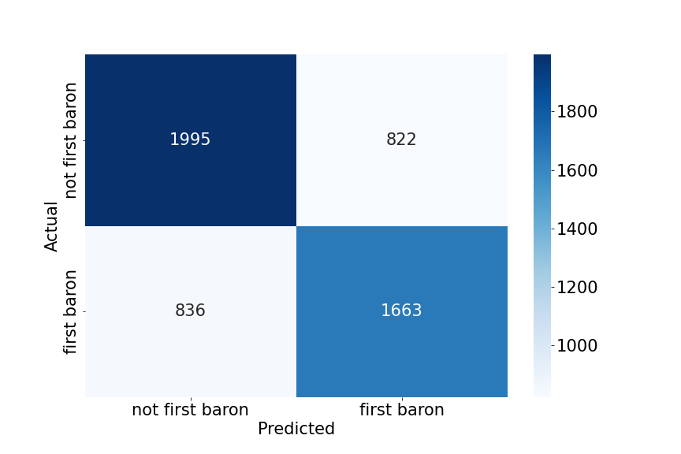

# League of Legends Champion Balance
*Irelia is broken*

by Sawyer Figueroa (s2figuer@ucsd.edu)

---


## Introduction

The dataset being investigated in this analysis is a dataset from [Oracle's Elixir](https://oracleselixir.com/tools/downloads).
This dataset contains game data for competitive League of Legend's matches in 2022. Each row corresponds to one player in each game with
two additional rows for full team data. In League of Legends, 10 players play the game at once, with 5 on one team and 5 on the other.
Each player has the option of choosing a "champion" that they will play throughout the entirety of the game. However, not all champions
are equal. The developers, Riot Games, do their best to ensure that each champion is capable of having equal impact on the game as all
others. Some players would argue that this is certainly not the case. "Unbalanced" champion statistics greatly affect the quality
of the game and the competitive integrity of the sport. This dataset of league of legends games at the highest level of play will 
hopefully shed light on what champions truly have a greater impact on the outcome of the game. In this analysis, I will be investigating
the following specific question:


**Does Irelia have more impact on the outcome of competitive matches than other midlaners?**


The dataset in question contains a total of **149400 rows** and **123 columns**. For our purposes, we will only be looking at **17 columns**. These are
*'gameid', 'position', 'champion', 'league', 'playername', 'kills', 'assists', 'teamname','doublekills', 'triplekills', 'quadrakills', 
'pentakills', 'datacompleteness', 'damagetochampions', 'dpm', 'damagemitigatedperminute', and 'totalgold'. The 'gameid', 'playername', 'league',
and 'teamname'* features are important to note because champion picks and overall performance often depend on particular games, players, leagues,
or teams. The 'position' and 'champion' features are arguable the most important because we will need to section the data based on a player's
position (midlane) and champion (Irelia). The remaining columns all generally relate to a specific player's impact on the game. For example,
a player with a pentakill and significantly larger damage to champions certainly had more impact on the game than a player with no multi-kills
and little damage to champions. Without further ado, let's dive in.

---

## Cleaning and EDA

The first step in the cleaning process was extracting the columns of interest as mentioned in the introduction. Second, I removed all rows
pertaining to full team data, as we want to focus and individual players and be sure not to repeat any already known data. The dataset
also contained quite a large amount of missing data, specifically in the 'doublekills', 'triplekills', 'quadrakills', 'pentakills',
and 'damagemitigatedperminute' columns. These values were imputed using *probabilistic imputation* conditioned on champion. The choice
for this imputation was made based on the fact that different champions tend to have different strengths and weaknesses no matter their role.
So it wouldn't be fair to draw a value for the amount of damage to dealt to champions for Yone from the same distribution as Lulu for example.
Missing values from the 'damagetochampions' and 'dpm' columns were dropped as only 10/149400 rows contained missing values. Finally, the
data was filtered to only included players in the 'position' of 'mid'.

Here is final cleaned dataframe:


| gameid                | position   | champion   | league   | playername   |
|:----------------------|:-----------|:-----------|:---------|:-------------|
| ESPORTSTMNT01_2690210 | mid        | LeBlanc    | LCK CL   | Feisty       |
| ESPORTSTMNT01_2690210 | mid        | Viktor     | LCK CL   | FIESTA       |
| ESPORTSTMNT01_2690219 | mid        | Orianna    | LCK CL   | TolanD       |
| ESPORTSTMNT01_2690219 | mid        | Renekton   | LCK CL   | Ten10        |
| 8401-8401_game_1      | mid        | Syndra     | LPL      | Creme        |


|   kills |   assists    | teamname                      |   doublekills |   triplekills |
|--------:|-------------:|:------------------------------|--------------:|--------------:|
|       2 |         3    | Fredit BRION Challengers      |             0 |             0 |
|       6 |        12    | Nongshim RedForce Challengers |             2 |             0 |
|       2 |         0    | T1 Challengers                |             0 |             0 |
|       5 |         7    | Liiv SANDBOX Challengers      |             0 |             0 |
|       3 |         5    | Oh My God                     |             0 |             0 |

|   quadrakills |   pentakills | datacompleteness   |   damagetochampions |
|--------------:|-------------:|:-------------------|--------------------:|
|             0 |            0 | complete           |               14258 |
|             0 |            0 | complete           |               20690 |
|             0 |            0 | complete           |               23082 |
|             0 |            0 | complete           |               11261 |
|             0 |            0 | partial            |               12577 |

|     dpm |   damagemitigatedperminute |   totalgold |   impact_score |
|--------:|---------------------------:|------------:|---------------:|
| 499.405 |                    227.776 |        9715 |        7.65728 |
| 724.693 |                    426.935 |       11532 |       13.7298  |
| 655.118 |                    366.698 |       15149 |       12.5572  |
| 319.612 |                    950.095 |       14999 |       11.5279  |
| 552.835 |                    126.741 |        9928 |        7.55822 |


<iframe src="assets/mid_dpm.html" width=800 height=600 frameBorder=0></iframe>

The previous figure depicts the distribution of the damage per minute dealt by midlaners across all games. It appears that the majority
of midlaners secure 0-1000 dpm while very few get above 1500.

<iframe src="assets/pos_impact_scores.html" width=800 height=600 frameBorder=0></iframe>

Looking at the impact score distributions across all roles, we can see that support players tend to have lower impact while midlaners
and botlaners have higher impact. This supports our decision to limit the analysis to midlaners, so as not to have confounding variables
in our final results.


|league  |     LCS |     LCK |     LEC |     LPL |
|champion|         |         |         |         |
|-------:|--------:|--------:|--------:|--------:|
|Irelia  | 17836   | 15323   | 10744   | 12474   |
|Sylas   | 14356.7 | 14518.6 | 17322.7 | 14935.2 |
|Malzahar| 16165   | 11252   | 24040   |   nan   |
|Akshan  |   nan   |   nan   |  8853   |   nan   |
|Ahri    | 15417.5 | 16258.1 | 20015   | 16721.3 |


In this table, we compare the total damage to champion average aggregates between 4 popular competitive leagues and 5 popular midlane champions.
It's clear that Irelia has varying performance in different regions due to differences in playstyle, therefore, it could be the case that
Irelia is more impactful to the game in some leagues, but not in others.

---

## Assessment of Missingness

In assessing the missingness of the original dataframe with columns of interest selected, I decided to compare the distributions of the variables
*'league' and 'totalgold'* conditioned on the missingness of the variable 'teamname'. For both cases, I performed a permutation test with
5000 empirical iterations and calculated p-value based on the observed test statistic (total variation distance for 'league' and absolute
mean difference for 'totalgold').

Below is a plot comparing the distributions 'leagues' when 'teamname' is missing vs. when it is not missing.

<iframe src="assets/league_dist.html" width=800 height=600 frameBorder=0></iframe>

The p-value of the permutation test was **0.0**, leading us to *reject* the null hypothesis that distributions come from the same population at the
0.05 and 0.01 significance level. This indicates that, as expected from the plot, the missingness of 'teamname' is dependent on the 
league the match took place under for this dataset. This is an example of MNAR.

Below is a plot showing the distribution of the test statistic for the permutation test comparing the distribution of 'totalgold' 
when 'teamname' is missing vs. when it is not missing.

<iframe src="assets/hyp2.html" width=800 height=600 frameBorder=0></iframe>

The p-value of the permutation test was **0.4318**. We therefore *cannot reject* the null hypothesis that distributions came from the same
population and cannot conclude that this is an example of NMAR.

---

## Hypothesis Testing

---

Finally, we move on to a hypothesis test that attempts to answer the champion in question, Irelia. For this hypothesis test we will be using
a permutation test to see whether or not the distribution of impact scores of Irelia and from other champions come from the same population.
Our **null hypothesis** will be that there is no difference between the distribution of Irelia's impact score and that of other midlaners and our
**alternative hypothesis** will be that the distribution of Irelia's impact score is greater than that of other midlaners. The test statistic we
will be using to perform this permutation test is the **difference in mean impact score** between both groups as shown below:

```py
observed = mid_df[mid_df['champion']=='Irelia']['impact_score'].mean() - mid_df[~(mid_df['champion']=='Irelia')]['impact_score'].mean()
```

It is proper to use a permutation test here because two full distributions are being compared. The difference in means is a valid test
statistic because it accurately sums up the central difference between impact scores of Irelia and other champions. We will not be using
the absolute difference in the mean here because we are interested in whether or not Irelia's impact score is *higher* than that of
other champions as stated by the alternative hypothesis.

The observed distributions look as follows:

<iframe src="assets/irelia_v_others.html" width=800 height=600 frameBorder=0></iframe>

Additionally, we will use a **significance level** of 0.05. After performing the test with 5000 simulated iterations a **p-value** of 0.0218
was obtained. We can therefore *reject* the null hypothesis that the distribution of impact scores from Irelia and from other champions come
from the same population at the 0.05 significance level. 

Although, this is something anyone could figure out by simply playing League of Legends, it is important to reveal imbalances in player
performance based on inherent factors in the game and not just skill issues. Hopefully, further analyses will incite changes in the
development of the game and increase gaming quality and enjoyment for everyone. Thanks for reading!

---


# Who gets the first baron?
*A classification analysis*

--------------------------------------
## Framing the Problem
--------------------------------------
In this machine learning exploration, I will be performing a classification analysis using a dataset from Oracle’s Elixir 
which contains game data for all competitive League of Legend’s matches in 2022. The exploratory data analysis of this dataset 
can be found in a previous project [here](https://sm-figueroa.github.io/LOL_champion_balance/).

The purpose of this classification analysis is to solve the following problem: can we predict which team kills the first baron in a match based on pre-game data and data from the first 15 minutes of that match? To solve this problem we will develop a binary classification model that, based on a 
set of features, outputs that a team in a given match either did or did not get the first baron. This corresponds to the column
labeled **firstbaron** in the dataset. This response variable was chosen from this dataset because it allows for both quantitative and categorical variables to be used as features in the model. Additionally, this variable requires us to perform a binary classification, which is a lot simpler than predicting the name of an individual player based on their post game statistics (multiclass classification). With multiple types of features and fewer classes to predict, we will hopefully increase the likelihood of creating a useful model. 

It is worth noting that the baron spawns at 20 minutes into the game in each match so all the data we will be using as features (pre-15 minutes) will be known at the time of prediction. The metric that will be used 
to evaluate all models in this analysis is the F1-score. This metric was chosen because, in the case of this problem, we value 
both precision and recall equally and don't want inbalances in our dataset to affect the performance of our model as is often the 
case when soley using accuracy as a metric. Without further ado, let's start building the models.

-------------------------------------
## Baseline Model
-------------------------------------
The initial model trained in this analysis was a Random Forest Classifier. This classifier was trained on two initial features.
The first was a nominal feature labeled *playoffs* in the dataset which contains boolean values denoting whether or not a match was
a playoff match. The second feature was a quantitative feature labeled *golddiffat15* in the dataset, referring to the difference 
in gold (team - enemy team) between the two teams at 15 minutes into the game. Both of these features requried no encodings and were not 
transformed in any way before feeding them into the model. First, the data was split into training and test splits with a test size 
of 0.25 then the model was trained only on the training data. The resulting training, average cross-validation (5 folds), and test 
f1-scores were **0.862, 0.573, and 0.579** respectively. This baseline model shows great performance on the training data and performance that is barely above chance on the cross-validation and test data. This suggests that model is not very good in that it has overfit to the training data and 
is showing high variance in response to unseen data. In the next section we will create a new model to help with generalizability.

-------------------------------------
## Final Model
-------------------------------------
In the final model, I choose to include the following features in total: *playoffs*, *golddiffat15*, *side*, *xpdiffat15*, *csdiffat15*, 
*killsat15*, *assistsat15*, and *deathsat15*. The *playoffs* feature likely affects the outcome of our classifier because playoff games 
tend to be slower than season games and, in my opinion, likely increase the chance that baron is capture by a team at all. The other 
categorical metric *side* likely has an effect on who gets the first baron because teams that play on the red side are closer to the 
baron and therefore may have an advantage in capturing the first one. The quantitative features *golddiffat15*, *xpdiffat15*, and *csdiffat15* 
are all good measures of how powerful a team is compared to the enemy. More cs and gold correlates with more items which, along with xp, correlates 
with more powerful abilites and attacks, increasing the likelihood that a team will capture the first baron. Finally, the remaining quantitative
features *killsat15*, *assistsat15*, and *deathsat15* are again good indicators of not only how powerful a team is, but their fighting ability 
in the current match.

Again, the classification model used in this analysis was a Random Forest Classifier. The categorical columns *playoffs* and *side* were 
transformed using One Hot Encoding, dropping the first category. The quantitative features *golddiffat15*, *xpdiffat15*, and *csdiffat15* are all values with wildy different means and variations so they were transformed using a Standard Scaler. Finally, the remaining features features *killsat15*, *assistsat15*, and *deathsat15* were aggregated using a Function Transformer to create a singular *kda* value. The results of all of these transformations were passed into the Random Forest Classifier which produced training, average cross-validation (5 folds), and test f1-scores of 
**1.0, 0.660, and 0.648** respectively.

To improve the model's accuracy, hyperparameter tuning was conducted using sklearn's GridSearchCV. The following hyperparameter combinations were 
tested:

`hyperparameters = {
                       'random_forest__max_depth': [3, 5, 10, None],
                       'random_forest__max_features': ['auto', 'sqrt'],
                       'random_forest__min_samples_leaf': [1, 2, 4],
                       'random_forest__min_samples_split': [2, 5, 10],
                       'random_forest__n_estimators': [230, 300, 350]}`
            
The hyperparameters that minimized the average cross-validation f1-score (5 folds) across all combinations were as follows:

`{'random_forest__max_depth': 5,
 'random_forest__max_features': 'sqrt',
 'random_forest__min_samples_leaf': 4,
 'random_forest__min_samples_split': 5,
 'random_forest__n_estimators': 230}`
 
When retraining the model on the training set the resulting training, average cross-validation (5 folds), and test f1-scores were **0.689, 0.681, 
and 0.668** respectively. The f1-score on the cross-validation and test set improved by nearly 0.1 from the baseline model. Initially, the final model was grossly overfit, getting a perfect f1-score on the training dataset, but with hyperparameter tuning where the max depth of each tree in the forest was decreased to 5 and the number of trees was increased to 230, the f1-score of the model increased on unseen data and decreased substantially on the training data to a more reasonable score.

Below is a confusion matrix showing the performance of the final model on the testing set:



----------------------------------------
## Fairness Analysis
----------------------------------------
Now we'll test to see if our model can classify whether or not a team got the first baron in a match equally well for teams on the red side and 
teams on the blue side. As in our previouis analysis, the metric we will use is the F1-score. We will perform a permutation test between the two
groups to see if the F1-scores of red and blue side teams come from the same distribution.

Null Hypothesis: The model is fair. The f1 score for teams playing on red side versus blue side are roughly the same and differences between 
them are due to random chance

Alternative Hypothesis: The model is unfair. The f1 score for teams playing on the red side is higher than the F1-score for teams playing on 
the blue side. The difference in f1 scores (red-blue) is greater than observed based on random chance.

The test statistic used in this permuatation is the difference (red - blue) in F1-scores between the two groups. We will conduct this test with a 
significance level of 0.05.

<iframe src="assets/fairness_perm_test.html" width=800 height=600 frameBorder=0></iframe>

The resulting p-value from this permutation test is **0.611** meaning we fail to reject the null hypothesis at the 0.05 significance level. Therefore 
we cannot conclude that the model's ability to classify whether or not a team got the first baron is unfairly distributed across the teams playing 
on red and blue sides of the map.

----------------------------------------------

Ultimately, the information from this dataset helped us build a decent model for predicting which team will get the first baron in competitive league of legends scenarios. This analysis supports that the features included in this model are relevant factors to objective control and, as we all know, objective control is the key to league of legends. Thanks for reading.

# FIN.